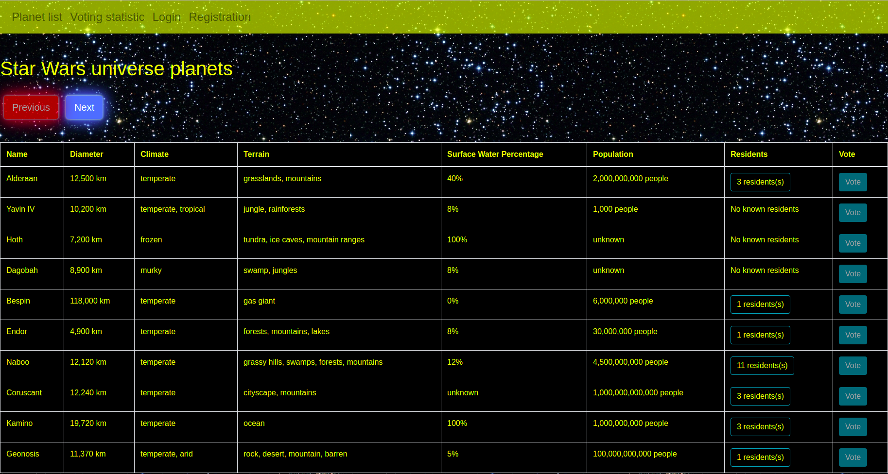
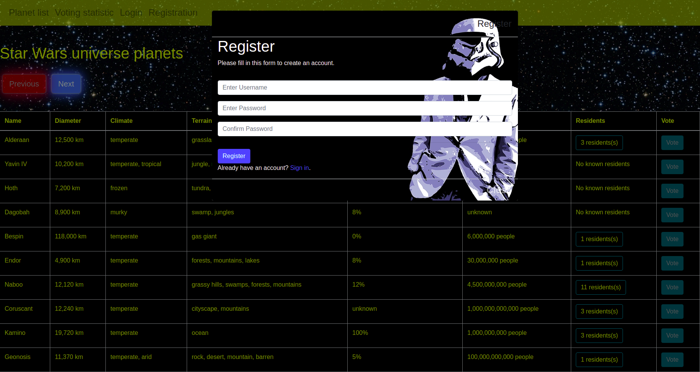
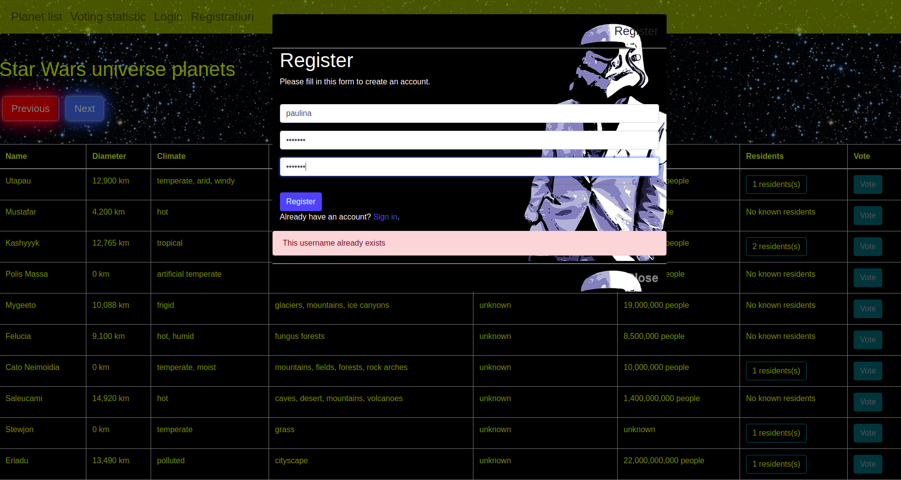
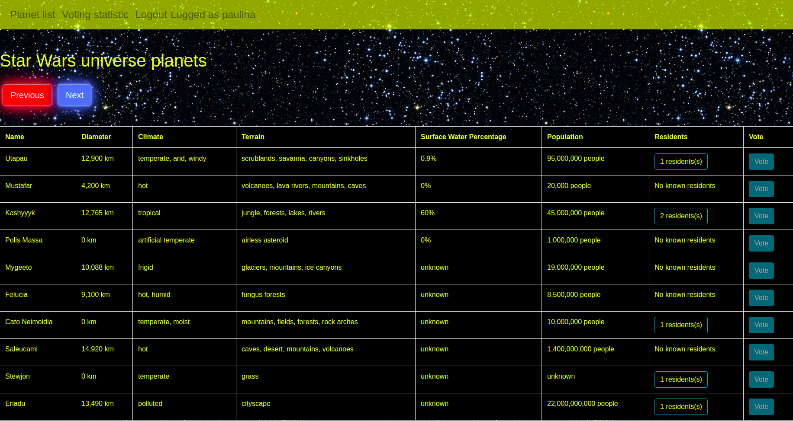
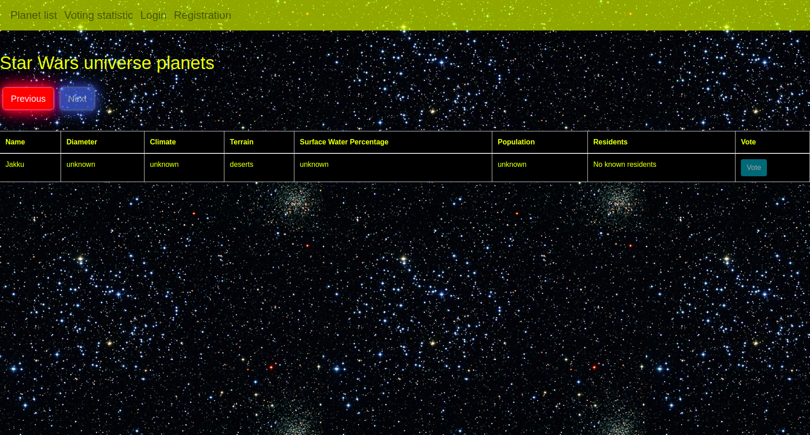

# API Wars

Web application which shows data about the Star Wars Universe, store visitors preferences with cookies and handle user login with sessions.

## Used technologies

* Flask
* Bootstrap
* HTML + CSS
* AJAX request (fetch)
* PostgreSQL
* JavaScript DOM

## Main features

Numeric columns in the table has been formatted. Each planet has an information about the number of residents.
If there are any we have a button that after clicking on it, it shows us modal with detail information about those residents.

This web aplication is equipped with a user login system. It comprises of:

* registration modal with some validation and salted password hashing

* separate login modal

* display of user name on the navigation bar when he is logged
* logout button

* users can vote planets and display statistics about those votes
* users and votes data are sotored in a Postgres database

Used data comes from swapi.co. To show next and previous chunks of planets lists pagination buttons were implemented.

 

